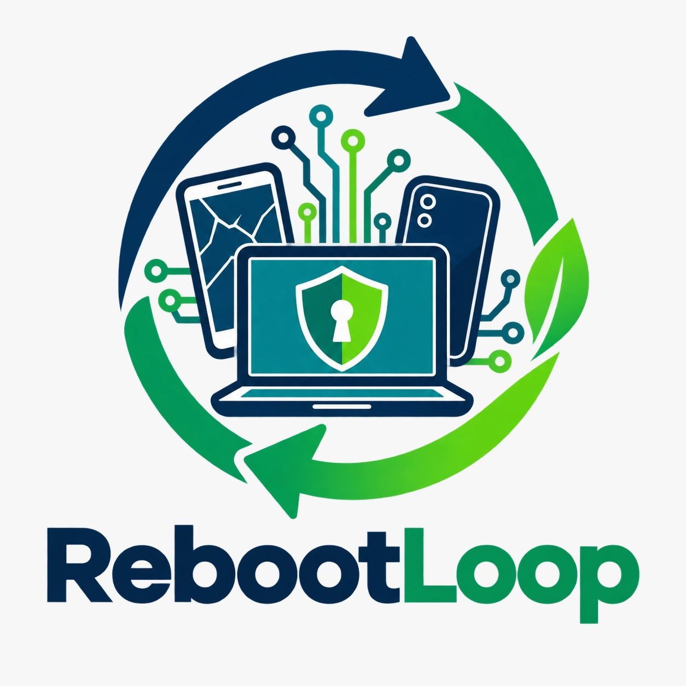
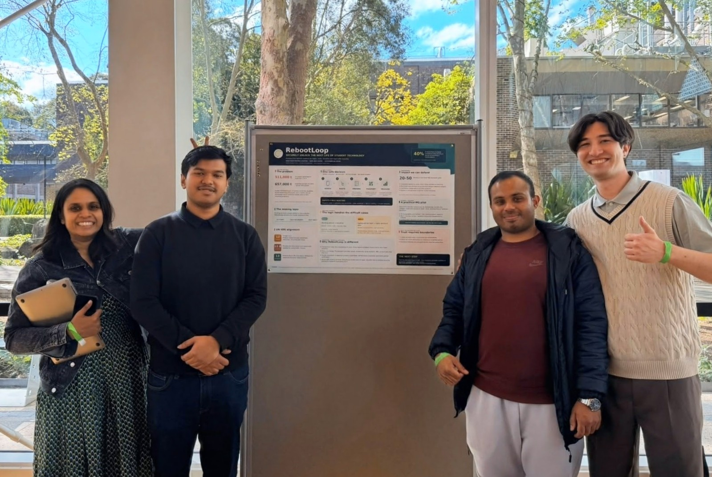
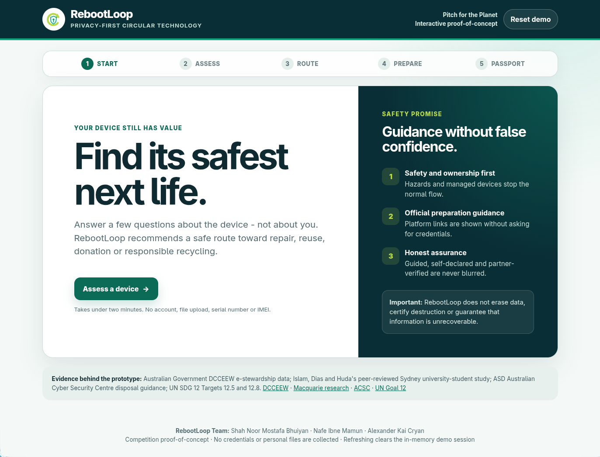
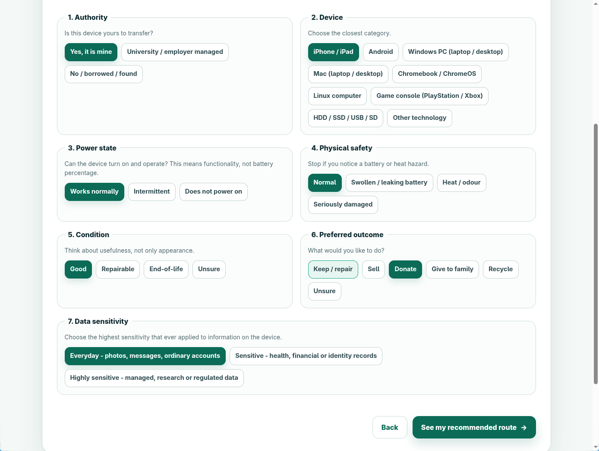
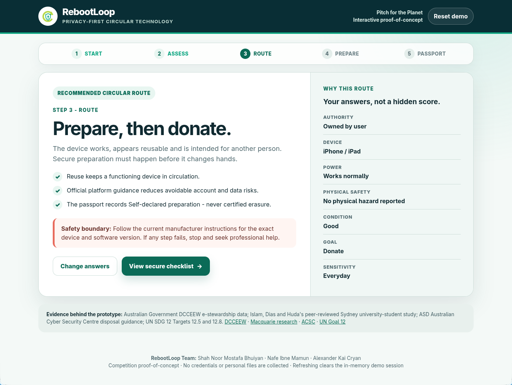
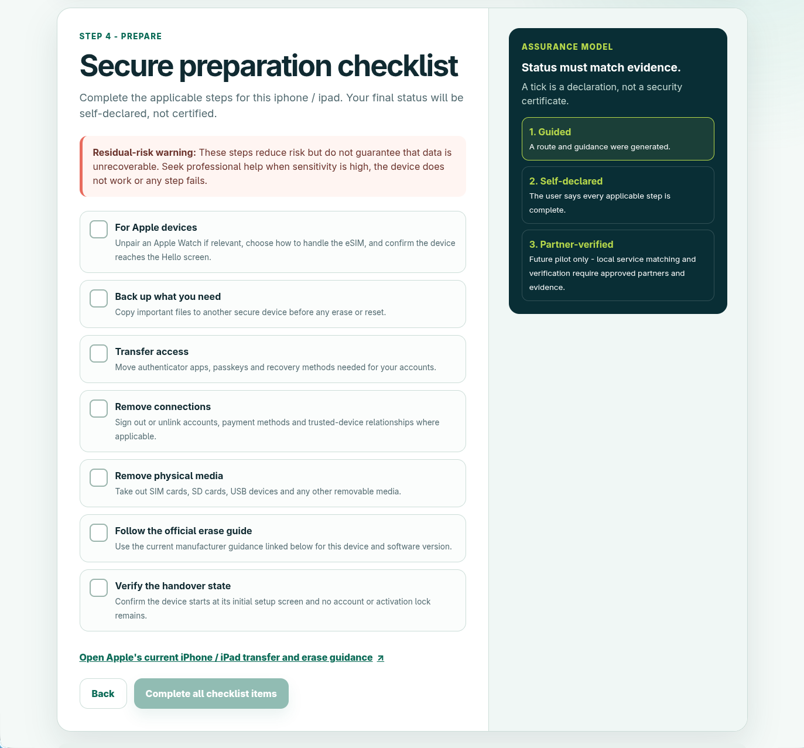
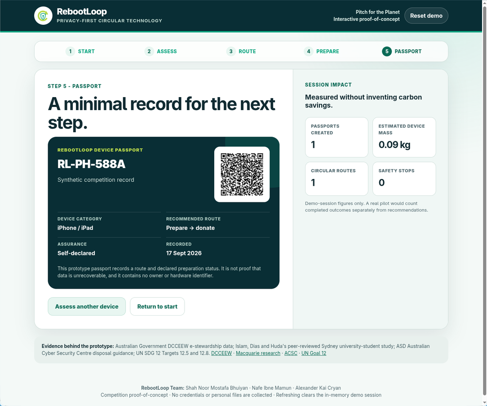

<p align="center">
  
</p>

# RebootLoop ↻

**A privacy-first decision-support platform helping university students securely repair, reuse, donate or recycle old technology.**

🏆 Placed **5th of 24 teams** at Macquarie University's *Pitch for the Planet 2026* (Faculty of Science and Engineering).



---

## The problem

Students often keep unused phones, laptops and storage devices in drawers — not because they don't care about sustainability, but because they're uncertain whether their personal data can still be recovered, and unsure what to do next. This creates both an e-waste problem and a cybersecurity barrier.

## What RebootLoop does

In under two minutes, a user answers a short set of non-identifying questions about a device (ownership, power state, physical safety, condition, goal, and data sensitivity). RebootLoop then:

- **Routes** the device toward the safest next step: repair, reuse, donation, or responsible recycling — or stops the process entirely for hazardous or non-owned devices
- **Guides** secure, platform-specific data preparation (iPhone/iPad, Android, Windows, Mac, removable media)
- **Generates** a minimal QR "device passport" recording the route and an honest assurance level (guided / self-declared / partner-verified)
- **Measures** aggregate impact (devices assessed, route mix, estimated mass diverted) without inflating claims

RebootLoop does **not** erase data, certify sanitisation, or guarantee non-recoverability. It is a decision layer *before* handover — not a replacement for existing recycling/reuse schemes like MobileMuster or the NTCRS.

## Try it

**Live demo: [rebootloopmq.github.io/RebootLoop](https://rebootloopmq.github.io/RebootLoop/)**

The prototype runs entirely offline in the browser — no accounts, no backend, no data collection.

```bash
git clone https://github.com/RebootLoopMQ/RebootLoop.git
cd RebootLoop/prototype
open index.html   # or double-click it
```

## Walkthrough

| Start | Assess |
|---|---|
|  |  |

| Route | Prepare |
|---|---|
|  |  |

### Passport



## Routing logic

Priority order: **physical safety → authority/ownership → data sensitivity → device viability → circular outcome → convenience.**

Every recommendation is produced by explicit, inspectable rules — not an opaque AI score. See [`/docs`](./docs) for the full routing table and five mandatory edge-case tests.

## Evidence & sources

RebootLoop's problem framing and safety boundaries are grounded in published research and government guidance, not assumption:

- **511,000 t** of e-waste generated in Australia in 2019, projected to reach **657,000 t by 2030** — [Australian Government DCCEEW](https://www.dcceew.gov.au/environment/protection/waste/e-waste)
- Sydney university students know *what* e-waste is but have a real knowledge gap around collection points and recycling programs — Islam, Dias & Huda, [Macquarie University research](https://researchers.mq.edu.au/en/publications/young-consumers-e-waste-awareness-consumption-disposal-and-recycl/) (2021)
- **81%** of people would be more inclined to hand down a phone if they knew how to remove their data properly, and **36%** worry about the data stored on their old phones — [MobileMuster](https://www.mobilemuster.com.au/?p=5020)
- Correct disposal preparation reduces but does not guarantee data cannot be recovered — [Australian Cyber Security Centre (ACSC)](https://www.cyber.gov.au/protect-yourself/securing-your-devices/how-secure-your-device/how-dispose-your-device-securely)
- Aligns with **UN SDG 12** Targets 12.5 (waste reduction/reuse/recycling) and 12.8 (awareness and information) — [UN SDG 12](https://sdgs.un.org/goals/goal12)

Full citation table, links, and a note on stats we checked and deliberately excluded: [`docs/evidence-sources.md`](./docs/evidence-sources.md).

## Tech stack

- Vanilla HTML / CSS / JavaScript (offline-first, zero dependencies)
- No accounts, no server, no data persistence beyond the browser session

## Team

| Role | Name |
|---|---|
| Project Coordination + Cybersecurity Lead | Shah Noor Mostafa Bhuiyan |
| Sustainability + Evidence Lead | Nafe Ibne Mamun |
| UX + Practicality Lead | Alexander Kai Cryan |

## Roadmap

- [ ] MQ discovery pilot (20–50 devices)
- [ ] Verified partner directory for repair/donation/recycling
- [ ] Accessibility review
- [ ] Partner-verified assurance state (real evidence-backed sanitisation records)

## Alignment

Primary: **UN SDG 12** (Responsible Consumption and Production — Targets 12.5, 12.8)
Supporting: **UN SDG 13** (Climate Action)

## License

MIT (see [LICENSE](./LICENSE)) — adjust if your team prefers something else.
