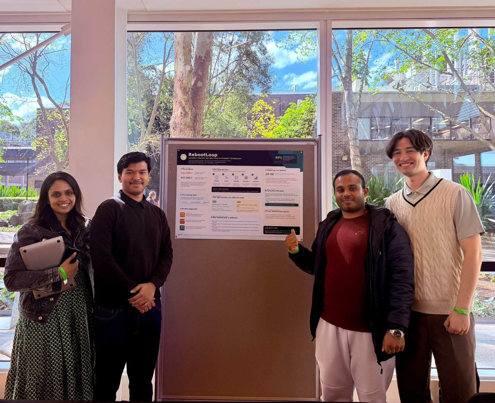
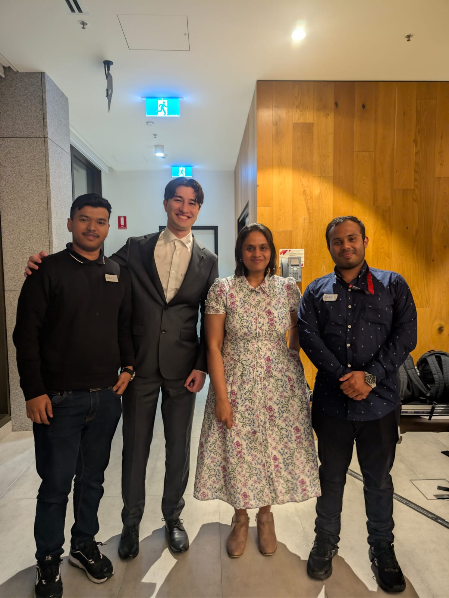

<p align="center">
  
  
</p>

# RebootLoop ↻

**A public, privacy-conscious decision-support prototype helping people choose a safer next step for unused technology.**

🏆 Placed **5th of 24 teams** at Macquarie University's *Pitch for the Planet 2026* (Faculty of Science and Engineering).



**[View the showcase poster (PDF)](./docs/poster-showcase.pdf)** · [Original competition poster (PDF)](./docs/poster.pdf)

---

## The problem

Students often keep unused phones, laptops and storage devices in drawers — not because they don't care about sustainability, but because they're uncertain whether their personal data can still be recovered, and unsure what to do next. This creates both an e-waste problem and a cybersecurity barrier.

## What the Phase 2 public version does

In under two minutes, a user answers a short set of non-identifying questions about a device (ownership, power state, physical safety, condition, goal, and data sensitivity). RebootLoop then:

- **Routes** the device toward repair, transfer or recycling, with explicit stops for hazards, non-owned devices, high-sensitivity data, non-functioning devices and storage media that need a specific process
- **Guides** preparation with links to official sources for working consumer devices; stops when a reset cannot be completed or checked
- **Shows a relevant public pathway** for eligible phones (MobileMuster) and computers (NTCRS), with accepted-item checks and no claimed partnership
- **Breaks the route into two next steps**, such as wiping the device with the official guide and then handing it over or dropping it off, with a residual-risk warning up front. For a handover, it offers a printable note that tells the next owner how to check the device was properly reset
- **Shows an estimated impact** for finishing the job: a CO₂e range for a typical phone, tablet or computer based on manufacturers' published footprints, or published recycling figures for recycle routes. People can save their plan by email, text, share sheet or copy
- **Explains a single-model carbon scenario** based on Apple's published iPhone 16 footprint; it does not claim measured carbon savings

RebootLoop does **not** erase data, certify sanitisation, or guarantee non-recoverability. It is a decision layer *before* handover — not a replacement for existing recycling/reuse schemes like MobileMuster or the NTCRS.

## Try it

**Website: [rebootloopmq.github.io/RebootLoop](https://rebootloopmq.github.io/RebootLoop/)** · **Demo: [rebootloopmq.github.io/RebootLoop/demo.html](https://rebootloopmq.github.io/RebootLoop/demo.html)**

The site is a set of static pages with no accounts or RebootLoop backend. Assessment answers and session counts remain in browser memory; hosting and external links may process ordinary access information. Reloading clears the assessment. A saved plan or printed next-owner note stays with the user unless they choose to share it.

```bash
git clone https://github.com/RebootLoopMQ/RebootLoop.git
cd RebootLoop/prototype
open index.html   # home page; the demo is demo.html
```

The [`prototype/`](./prototype) folder is the GitHub Pages deployment source: `index.html` (home), `demo.html` (the assessment), `why.html`, `industry.html` and `evidence.html`, sharing `styles.css`. The original competition screenshots remain in `assets/screenshots` as historical material; they do not depict the current public app.

## Routing logic

Priority order: **physical safety → authority/ownership → high data sensitivity → inability to reset / media-specific risk → device viability → preferred outcome.**

Every recommendation is produced by explicit, inspectable rules — not an opaque AI score. See [`/docs`](./docs) for the full routing table and five mandatory edge-case tests.

## Evidence & sources

RebootLoop's problem framing and safety boundaries are grounded in published research and government guidance, not assumption:

- **511,000 t** of e-waste generated in Australia in 2019, projected to reach **657,000 t by 2030** — [Australian Government DCCEEW](https://www.dcceew.gov.au/environment/protection/waste/e-waste)
- Sydney university students know *what* e-waste is but have a real knowledge gap around collection points and recycling programs — Islam, Dias & Huda, [Macquarie University research](https://researchers.mq.edu.au/en/publications/young-consumers-e-waste-awareness-consumption-disposal-and-recycl/) (2021)
- **40%** of people asked directly about data security considered it a barrier to recycling — [MobileMuster Annual Report 2024, p. 23](https://www.mobilemuster.com.au/wp-content/uploads/2026/02/MOB_AnnualReport2024_UPDATE.v1.pdf)
- Correct disposal preparation reduces but does not guarantee data cannot be recovered — [Australian Cyber Security Centre (ACSC)](https://www.cyber.gov.au/protect-yourself/securing-your-devices/how-secure-your-device/how-dispose-your-device-securely)
- Aligns with **UN SDG 12** Targets 12.5 (waste reduction/reuse/recycling) and 12.8 (awareness and information) — [UN SDG 12](https://sdgs.un.org/goals/goal12)

The carbon example and limits are in the [`evidence and claim ledger`](./docs/evidence-sources.md).

## Tech stack

- Vanilla HTML / CSS / JavaScript in a single file; no runtime network dependency for the assessment
- No accounts or RebootLoop backend; plans and the next-owner note are generated in the browser and only leave it if the user saves or shares them

## Team

| Role | Name |
|---|---|
| Project Coordination + Cybersecurity Lead | Shah Noor Mostafa Bhuiyan |
| Sustainability + Evidence Lead | Nafe Ibne Mamun |
| UX + Practicality Lead | Alexander Kai Cryan |

## Showcase and pilot status

The team presented at the **(Tech)^US BIT Industry Showcase on 8 October 2026** (19 teams, 4 winners) — see the [showcase feedback](./docs/showcase-feedback.md).



MobileMuster has been contacted for feedback; there is no confirmed partnership. A campus device-handling pilot needs separate university permission, privacy review and agreed partners. The immediate work is real usability testing and a truthful presentation of what people can do in the public app. See the [showcase test and evidence plan](./docs/showcase-test-plan.md) and [proposed pilot plan](./docs/pilot-plan.md).

Potential institution-funded operations and reporting are **business-model hypotheses**. There are no paying customers, price tests, pickup service or verified outcomes yet.

## Alignment

Primary: **UN SDG 12** (Responsible Consumption and Production — Targets 12.5, 12.8)
Supporting: **UN SDG 13** (Climate Action)

## License

MIT (see [LICENSE](./LICENSE)) — adjust if your team prefers something else.
